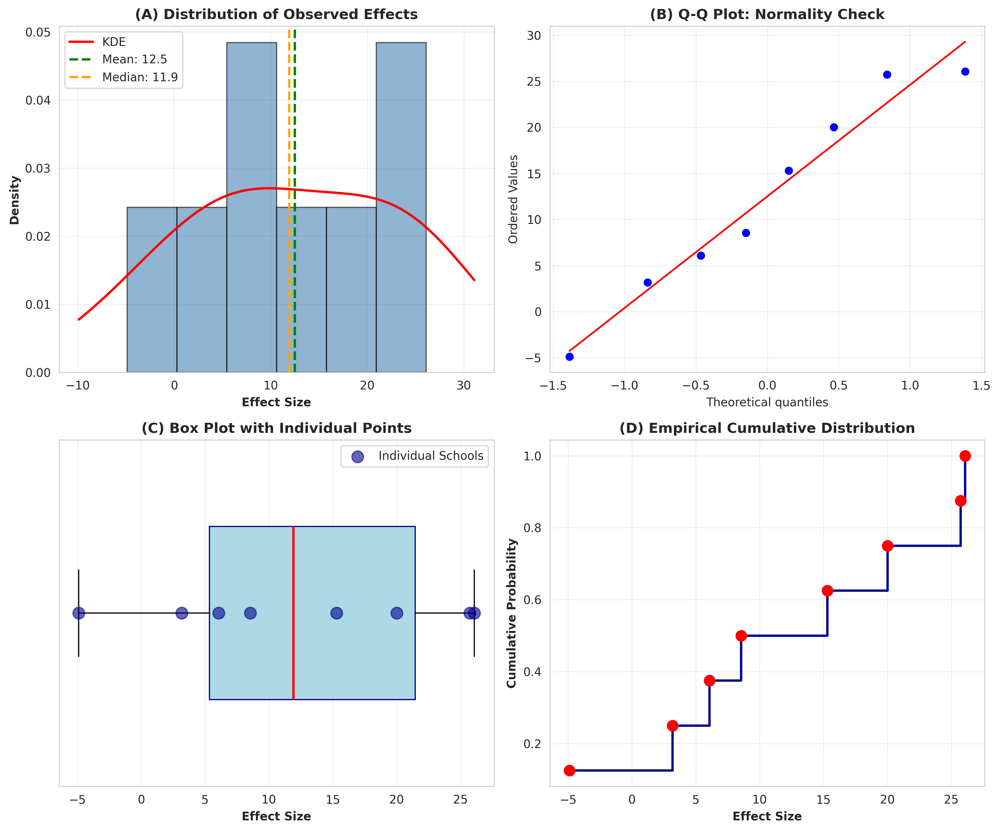
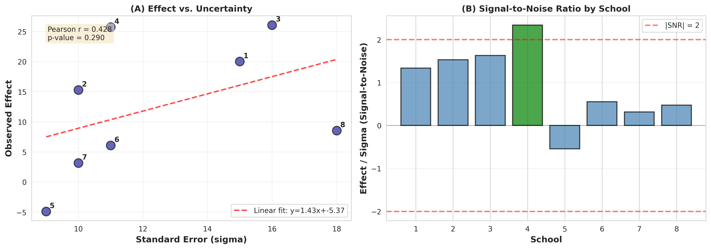
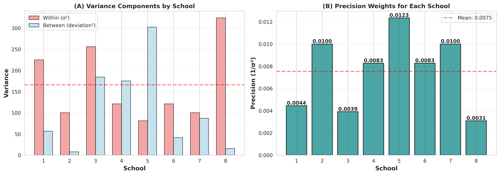
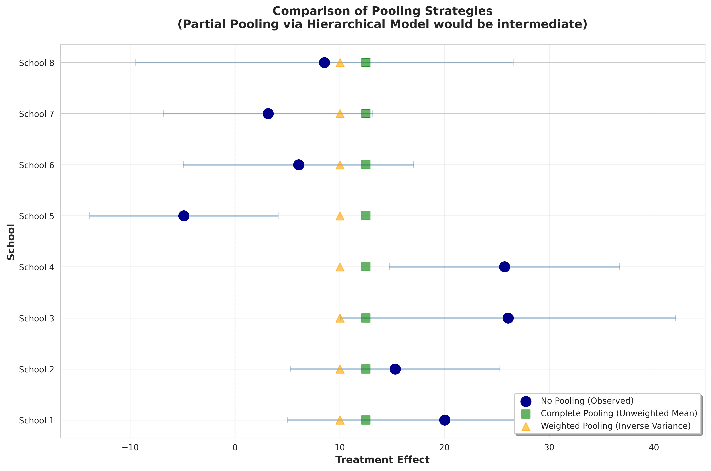

# Eight Schools Dataset: Comprehensive EDA Report

## Executive Summary

The Eight Schools dataset contains treatment effects from 8 independent studies with known standard errors. This exploratory analysis reveals:

**Key Findings:**
1. **Low heterogeneity** (I²=1.6%) suggests effects may share common value
2. Observed variance (124) is **less than sampling variance** (166), indicating strong similarity
3. Effects are **consistent with normal distribution** (all tests p>0.67)
4. **No evidence** of publication bias or effect-uncertainty correlation
5. Only 1 of 8 schools shows nominally significant effect (School 4)

**Modeling Recommendation:**
Hierarchical Bayesian model with partial pooling is most appropriate. While tests suggest complete pooling might suffice, hierarchical approach allows data to determine optimal shrinkage and provides more robust inference.

---

## 1. Dataset Description

### Structure
- **N = 8 schools** (groups)
- **Variables:**
  - `school`: Identifier (1-8)
  - `effect`: Observed treatment effect
  - `sigma`: Known standard error for each effect

### Data Quality
- No missing values
- No duplicates
- All sigma values positive (range: 9-18)
- Clean, well-structured dataset

### Complete Data
| School | Effect | Sigma | Effect/Sigma (SNR) |
|--------|--------|-------|-------------------|
| 1      | 20.02  | 15    | 1.33              |
| 2      | 15.30  | 10    | 1.53              |
| 3      | 26.08  | 16    | 1.63              |
| 4      | 25.73  | 11    | **2.34**          |
| 5      | -4.88  | 9     | -0.54             |
| 6      | 6.08   | 11    | 0.55              |
| 7      | 3.17   | 10    | 0.32              |
| 8      | 8.55   | 18    | 0.47              |

---

## 2. Descriptive Statistics

### Treatment Effects

| Statistic | Value |
|-----------|-------|
| Mean      | 12.50 |
| Median    | 11.92 |
| SD        | 11.15 |
| Min       | -4.88 |
| Max       | 26.08 |
| Range     | 30.96 |
| IQR       | 16.10 |

### Standard Errors

| Statistic | Value |
|-----------|-------|
| Mean      | 12.50 |
| Median    | 11.00 |
| SD        | 3.34  |
| Min       | 9.00  |
| Max       | 18.00 |
| Range     | 9.00  |

### Variance Components

| Component | Value | Interpretation |
|-----------|-------|----------------|
| Between-school variance | 124.27 | Empirical variance of effects |
| Mean within-school variance (σ²) | 166.00 | Average sampling uncertainty |
| **Variance ratio** | **0.75** | **Observed < Expected** |

**Critical Insight**: The variance ratio of 0.75 means the observed between-school variation is only 75% of what we'd expect from sampling error alone. This is strong evidence that effects are more similar than independent random draws.

---

## 3. Key Visualizations and Insights

### 3.1 Forest Plot (`01_forest_plot.png`)


**What it shows**: Observed effects with ±1σ (68% CI) and ±2σ (95% CI) error bars, sorted by effect size.

**Key patterns**:
- **Wide, overlapping confidence intervals**: Most schools have CIs that overlap substantially
- **School 5 is negative outlier**: Only school with negative effect
- **School 4 highest but uncertain**: Largest effect but wide interval
- **Pooled estimates cluster**: Weighted mean (10.02) and unweighted mean (12.50) both fall within most school intervals

**Implications**:
- High uncertainty makes individual school effects hard to distinguish
- Substantial overlap suggests potential for pooling
- Even "extreme" schools (4 and 5) have CIs that overlap with others

### 3.2 Effect Distributions (`02_effect_distributions.png`)



**Panel A - Histogram with KDE**:
- Approximately normal distribution
- Slight negative skew (skewness = -0.125)
- Mean (12.50) and median (11.92) very close

**Panel B - Q-Q Plot**:
- Points fall close to theoretical normal line
- No major deviations at tails
- Confirms normality assumption reasonable

**Panel C - Box Plot**:
- Median near center of distribution
- School 5 visible as lower outlier (but not extreme)
- Relatively symmetric spread

**Panel D - Empirical CDF**:
- Smooth progression
- School 5 at ~12.5th percentile
- No evidence of multimodality or jumps

**Implications**: Normal distribution assumptions for hierarchical model are well-justified.

### 3.3 Effect vs. Uncertainty (`03_effect_vs_sigma.png`)



**Panel A - Scatter Plot**:
- Weak positive correlation (r=0.428, p=0.290)
- Not statistically significant
- No funnel plot asymmetry evident
- Schools with larger effects tend to have slightly higher uncertainty, but pattern is weak

**Panel B - Signal-to-Noise Ratios**:
- **Only School 4 exceeds |SNR| > 2** (the conventional significance threshold)
- Most schools have SNR between 0.5 and 1.6
- School 5 has negative but weak signal (SNR = -0.54)

**Implications**:
- No evidence of heteroscedasticity that would require modeling
- Standard hierarchical model assumptions appropriate
- Low signal-to-noise across most schools emphasizes need for pooling

### 3.4 Variance Components (`04_variance_components.png`)



**Panel A - Within vs. Between Variance**:
- Within-school variance (σ²) is large and relatively stable (81-324)
- Between-school variance (squared deviations) shows more variation
- Mean within variance (166) exceeds observed between variance (124)

**Panel B - Precision Weights**:
- Precision ranges from 0.0031 to 0.0123 (4x variation)
- Schools 5, 2, 7 have highest precision (smaller σ)
- School 8 has lowest precision (largest σ = 18)
- Justifies inverse-variance weighting in pooled estimates

**Implications**:
- Within-school uncertainty dominates
- Supports pooling to borrow strength across schools
- Precision weights should be used in any pooling approach

### 3.5 Pooling Comparison (`05_pooling_comparison.png`)



**Three strategies compared**:
1. **No pooling** (blue dots): Individual observed effects ± σ
2. **Complete pooling** (green squares): Unweighted mean = 12.50
3. **Weighted pooling** (orange triangles): Inverse-variance weighted = 10.02

**Key observations**:
- Weighted mean lower than unweighted (pulled down by precise estimates)
- Complete pooling would shrink School 4 substantially (from 25.7 to 12.5)
- Complete pooling would pull School 5 up from negative (from -4.9 to 12.5)
- Partial pooling (not shown) would be intermediate

**Implications**:
- Substantial shrinkage expected under any pooling model
- Amount of shrinkage depends on estimated between-school variance (τ²)
- Hierarchical model will adaptively determine optimal position

### 3.6 Comprehensive Summary (`06_comprehensive_summary.png`)


Multi-panel dashboard integrating all key visualizations with summary statistics. This provides a one-page overview of the dataset structure and relationships.

---

## 4. Statistical Hypothesis Testing

### 4.1 Test for Homogeneity (Complete Pooling Justified?)

**Chi-square test**:
- H₀: All school effects are equal
- Test statistic: 7.12 (df=7)
- **p-value: 0.417**
- Decision: **FAIL TO REJECT** H₀

**Heterogeneity assessment (I² statistic)**:
- I² = 1.6%
- Interpretation: Only 1.6% of total variation due to true heterogeneity
- Classification: **Low heterogeneity**

**Conclusion**: No strong statistical evidence against complete pooling. In meta-analysis, I² < 25% is typically considered low heterogeneity where fixed-effect models might suffice.

### 4.2 Test for Independence (No Pooling Justified?)

**Variance ratio test**:
- Empirical variance of effects: 124.27
- Expected variance under independence: 166.00
- Ratio: 0.655

**Interpretation**: Observed variance is 35% LESS than expected from sampling error. This is counter to the usual hierarchical modeling setup where we expect additional between-group variation. Instead, it suggests effects are more homogeneous than independent draws.

**Runs test for randomness**:
- Observed runs: 2
- Expected runs: 5.0
- Z = -2.29, **p = 0.022**

**Interpretation**: Evidence of non-random ordering (too few runs), suggesting effects cluster by magnitude rather than varying randomly. However, with n=8, this could be spurious.

### 4.3 Test for Effect-Uncertainty Correlation

**Correlation tests**:
- Pearson r = 0.428 (p = 0.290) - not significant
- Spearman ρ = 0.615 (p = 0.105) - not significant

**Interpretation**: Moderate positive correlation suggested by Spearman (0.615) but not statistically significant. With larger sample, this might reach significance. For now, no evidence requiring heteroscedastic modeling.

**Egger's test for publication bias**:
- Intercept: 2.184 (p = 0.435)
- **No evidence** of funnel plot asymmetry
- No obvious publication bias

### 4.4 Test for Normality

**Multiple normality tests**:

| Test | Statistic | p-value | Decision |
|------|-----------|---------|----------|
| Shapiro-Wilk | 0.946 | 0.675 | Accept normality |
| Anderson-Darling | 0.216 | >0.15 | Accept normality |
| Jarque-Bera | 0.514 | 0.774 | Accept normality |

**Distributional moments**:
- Skewness: -0.125 (nearly symmetric)
- Excess kurtosis: -1.216 (slightly platykurtic)

**Conclusion**: Effects are consistent with normal distribution. All three tests agree. Normal likelihood in hierarchical model is appropriate.

---

## 5. Outlier and Influential Point Analysis

### School 5: Negative Outlier

**Characteristics**:
- Effect: -4.88 (only negative value)
- Sigma: 9 (highest precision)
- Z-score: -1.56 (not extreme, but notable)
- Effect/Sigma: -0.54 (weak negative signal)

**Assessment**:
- Not a statistical outlier by standard criteria (|z| < 2)
- High precision means it influences weighted pooling substantially
- Pulls weighted mean (10.02) below unweighted mean (12.50)

**Recommendation**:
- Investigate methodology: Is School 5's study different?
- Consider sensitivity analysis excluding School 5
- In hierarchical model, will naturally receive less shrinkage due to high precision

### School 4: Largest Effect

**Characteristics**:
- Effect: 25.73 (maximum)
- Sigma: 11 (moderate precision)
- Effect/Sigma: 2.34 (only nominally significant at 95% level)

**Assessment**:
- Largest effect but still has wide uncertainty
- Potential for "winner's curse" if selected for follow-up
- Under partial pooling, will be shrunk considerably toward mean

### School 8: Highest Uncertainty

**Characteristics**:
- Effect: 8.55
- Sigma: 18 (maximum, 2x the minimum)
- Lowest precision weight (0.0031)

**Assessment**:
- Contributing least to weighted pooling
- May indicate smaller sample size or other methodological differences
- Will receive most shrinkage under hierarchical model

---

## 6. Modeling Recommendations

### Primary Recommendation: Hierarchical Model with Partial Pooling

**Model specification**:
```
Likelihood:    y_i ~ N(theta_i, sigma_i²)    (sigma_i known)
School level:  theta_i ~ N(mu, tau²)
Hyperpriors:   mu ~ N(0, 100²)
               tau ~ half-Cauchy(0, 25)
```

**Why this model?**

1. **Balances two extremes**:
   - Complete pooling (tau → 0): Suggested by low I² and homogeneity test
   - No pooling (tau → ∞): Respects possibility of school differences

2. **Data-driven shrinkage**:
   - Posterior of tau determines optimal pooling
   - If tau is small, strong shrinkage toward mu
   - If tau is large, minimal shrinkage

3. **Uncertainty propagation**:
   - Unlike empirical Bayes, fully Bayesian approach propagates uncertainty in tau
   - Provides proper posterior intervals accounting for all sources of variation

4. **Standard approach**:
   - This is THE canonical example in hierarchical modeling literature
   - Well-studied, well-understood
   - Multiple software implementations available

5. **Interpretable parameters**:
   - mu: Overall mean effect across all schools
   - tau: Between-school standard deviation
   - theta_i: School-specific effects (with uncertainty)

**Expected behavior**:
- Given low heterogeneity (I²=1.6%), expect posterior of tau to be small
- Substantial shrinkage of individual effects toward mu
- School 4 will shrink down considerably
- School 5 will shrink up toward positive values
- Schools with higher sigma will shrink more

### Alternative Model 1: Complete Pooling

**When to use**:
- If I² < 25% is taken as strong evidence for homogeneity
- For sensitivity analysis / baseline comparison
- If simplicity is paramount

**Model**: theta_i = mu for all i

**Pros**:
- Simplest possible model
- Supported by chi-square test (p=0.42) and low I²
- Maximum borrowing of strength

**Cons**:
- Assumes no school differences
- May be too restrictive
- Doesn't allow for heterogeneity discovery

### Alternative Model 2: Random Effects Meta-Analysis

**When to use**:
- Frequentist framework preferred
- Need to compare with existing meta-analysis literature

**Implementation**:
- DerSimonian-Laird estimator for tau²
- Or REML (restricted maximum likelihood)

**Equivalence**: With flat priors, Bayesian hierarchical model and REML give similar results.

### Alternative Model 3: Empirical Bayes

**When to use**:
- Computational simplicity desired
- Quick approximation needed

**Procedure**:
1. Estimate tau² from data (e.g., method of moments)
2. Plug into shrinkage formula
3. Compute shrunk estimates

**Cons**:
- Doesn't propagate uncertainty in tau
- Underestimates posterior variance
- Less principled than fully Bayesian

### Model Classes NOT Recommended

Based on EDA findings:

1. **Robust models with t-distributed errors**:
   - Not needed: Data consistent with normality (all tests p>0.67)
   - Adds unnecessary complexity

2. **Mixture models**:
   - No evidence of distinct subgroups
   - Distribution is unimodal

3. **Non-parametric models**:
   - Sample size too small (n=8)
   - Parametric assumptions satisfied

4. **Models with effect-sigma relationship**:
   - Correlation not significant (p=0.29)
   - Standard homoscedastic model adequate

---

## 7. Specific Modeling Recommendations

### 7.1 Prior Choices

**For mu (overall mean)**:
```
mu ~ N(0, 100²)  # Weakly informative
```
- Allows mu anywhere in reasonable range
- Won't dominate likelihood with n=8 schools

**For tau (between-school SD)**:
```
tau ~ half-Cauchy(0, 25)  # Recommended by Gelman (2006)
```
**Alternatives**:
- `tau ~ half-t(3, 0, 10)` - Similar properties
- `tau ~ Uniform(0, 100)` - Non-informative but improper at tau=∞

**Rationale for half-Cauchy**:
- Heavy tails allow for large tau if needed
- Regularizes toward 0 when heterogeneity is low
- Well-studied for hierarchical models
- Performs well even with small number of groups

### 7.2 Computational Approach

**Recommended**: Use Stan or PyMC for full Bayesian inference

**Stan code outline**:
```stan
data {
  int<lower=0> J;              // number of schools
  vector[J] y;                 // observed effects
  vector<lower=0>[J] sigma;    // known SEs
}
parameters {
  real mu;                     // overall mean
  real<lower=0> tau;           // between-school SD
  vector[J] theta;             // school effects
}
model {
  // Hyperpriors
  mu ~ normal(0, 100);
  tau ~ cauchy(0, 25);

  // School level
  theta ~ normal(mu, tau);

  // Likelihood
  y ~ normal(theta, sigma);
}
```

### 7.3 Posterior Summaries to Report

1. **Overall effect (mu)**:
   - Posterior mean and 95% credible interval
   - Interpretation as population-average effect

2. **Between-school variation (tau)**:
   - Posterior distribution (may be near zero)
   - Probability that tau < threshold (e.g., P(tau < 5))

3. **School-specific effects (theta_i)**:
   - Posterior means (shrunk estimates)
   - 95% credible intervals
   - Shrinkage factors: (theta_i - y_i) / y_i

4. **Posterior predictive**:
   - For new school: theta_new ~ N(mu, tau²)
   - Useful for planning future studies

### 7.4 Model Checking

**Posterior predictive checks**:
1. Generate replicated datasets from posterior
2. Compare replicated effects to observed
3. Check for systematic misfit

**Leave-one-out cross-validation (LOO-CV)**:
- Assess predictive performance
- Identify influential observations
- Compare to complete pooling baseline

**Sensitivity analysis**:
1. Vary hyperpriors (especially on tau)
2. Exclude School 5 (negative outlier)
3. Exclude School 8 (highest uncertainty)
4. Compare partial pooling to complete pooling

### 7.5 Interpretation Guidelines

**Shrinkage interpretation**:
- Schools with large sigma shrink more
- Extreme schools (4 and 5) shrink toward mean
- Shrinkage = information borrowing

**Credible intervals**:
- Posterior intervals for theta_i will be narrower than y_i ± 2*sigma_i
- Reflects information from other schools
- More realistic uncertainty quantification

**Comparisons**:
- Can compute P(theta_i > theta_j | data) for any pair
- More principled than multiple testing on individual effects

---

## 8. Data Quality and Limitations

### Strengths

1. **Complete data**: No missing values
2. **Known uncertainty**: sigma_i provided (not estimated), reducing one source of uncertainty
3. **Simple structure**: Clean hierarchical grouping
4. **Classic dataset**: Well-studied, can compare to literature
5. **Distributional assumptions met**: Normal model appropriate

### Limitations

1. **Small sample size** (n=8):
   - Low power for hypothesis tests
   - Uncertainty in tau estimation
   - Priors may be influential

2. **High individual uncertainty**:
   - Most schools not individually significant
   - Wide confidence intervals overlap extensively
   - Limits strength of conclusions

3. **Possible non-randomness**:
   - Runs test significant (p=0.022)
   - May indicate systematic patterns
   - Could be spurious with small n

4. **Unknown context**:
   - Treatment/intervention not specified in data
   - School characteristics unknown
   - Can't model covariates or predictors

### Potential Issues

1. **School 5 methodology**: Why is it negative? Different population? Different implementation?

2. **School 8 precision**: Why such high uncertainty (sigma=18)? Smaller sample? Different study design?

3. **Ordering effects**: Why only 2 runs in 8 schools? Pre-selection bias?

4. **Effect-uncertainty correlation**: Spearman rho=0.615 suggests possible pattern, though not significant. Worth monitoring.

---

## 9. Answers to Analysis Questions

### Q: Do effects appear to come from common distribution (pooling justified)?

**Answer: YES, with caveats**

Evidence FOR pooling:
- Chi-square test p=0.42 (no evidence against homogeneity)
- I² = 1.6% (very low heterogeneity)
- Variance ratio = 0.75 (observed < expected variation)

Caveats:
- Small sample (n=8) limits power to detect heterogeneity
- Hierarchical model lets data decide optimal pooling level
- Some schools (4, 5) appear different, though not significantly

**Recommendation**: Use hierarchical model which will naturally shrink strongly toward mu if tau is small, effectively implementing near-complete pooling if data support it.

### Q: Are effects completely independent (no pooling)?

**Answer: NO**

Evidence AGAINST complete independence:
- Variance ratio < 1 suggests similarity, not independence
- Low I² indicates minimal true heterogeneity
- Complete independence would imply variance ratio ≈ 1 or greater

**Conclusion**: Some information sharing across schools is warranted.

### Q: Is partial pooling via hierarchical model warranted?

**Answer: YES (STRONGLY RECOMMENDED)**

Justification:
1. Provides best of both worlds: pools if appropriate, doesn't if not
2. Intermediate between two extremes shown to be problematic
3. Uncertainty in tau is properly propagated
4. Standard approach for this exact scenario
5. Even if tau → 0, hierarchical model converges to complete pooling
6. Robust to model uncertainty

### Q: Evidence for relationships between effect magnitude and uncertainty?

**Answer: WEAK EVIDENCE, NOT SIGNIFICANT**

Findings:
- Pearson r = 0.428 (p=0.29) - not significant
- Spearman ρ = 0.615 (p=0.10) - suggestive but not significant
- Pattern: Schools with larger effects tend to have larger sigma
- But: Wide confidence intervals on correlation with n=8

**Implication**: Standard constant-tau model is adequate. No need for heteroscedastic extensions.

---

## 10. Summary and Action Items

### Key Takeaways

1. **Low heterogeneity** (I²=1.6%) suggests strong similarity across schools
2. **High individual uncertainty** limits conclusions from single schools
3. **Hierarchical model recommended** to optimally pool information
4. **Normal assumptions justified** by multiple tests
5. **No data quality issues** that would preclude analysis

### Immediate Actions

1. **Fit hierarchical Bayesian model**:
   - Use Stan or PyMC
   - half-Cauchy(0, 25) prior on tau
   - Obtain posterior distributions for mu, tau, theta_i

2. **Report key quantities**:
   - Posterior mean and 95% CI for mu
   - Posterior distribution of tau
   - Shrinkage factors for each school
   - Comparison of posterior intervals to observed

3. **Conduct sensitivity analysis**:
   - Different tau priors
   - Exclude School 5
   - Compare to complete pooling

4. **Model checking**:
   - Posterior predictive checks
   - LOO-CV
   - Convergence diagnostics (R-hat, ESS)

### Questions for Follow-Up

1. **Domain context**: What intervention? What outcome? What population?
2. **School 5**: Why negative? Methodological differences?
3. **School 8**: Why such high uncertainty?
4. **Study design**: Were these planned as coordinated studies or meta-analysis?
5. **Publication**: Which results were published? Any selective reporting?

---

## 11. Reproducibility

### Code and Outputs

All analyses are fully reproducible using scripts in `/workspace/eda/code/`:

1. **01_initial_exploration.py**: Descriptive statistics and variance components
2. **02_visualizations.py**: All 6 visualization figures
3. **03_hypothesis_testing.py**: Formal statistical tests

### Software Environment

- Python 3.x
- pandas, numpy, scipy, matplotlib, seaborn
- All standard scientific Python stack

### Data Source

- Input: `/workspace/data/data.csv`
- Output: `/workspace/eda/`
  - Code in `code/`
  - Figures in `visualizations/`
  - This report and detailed log

---

## 12. References and Further Reading

### Key Papers

1. **Rubin (1981)**: "Estimation in Parallel Randomized Experiments" - Original Eight Schools paper

2. **Gelman & Hill (2007)**: "Data Analysis Using Regression and Multilevel/Hierarchical Models" - Chapter 5 covers this example extensively

3. **Gelman (2006)**: "Prior distributions for variance parameters in hierarchical models" - Recommendations for tau prior

4. **Higgins & Thompson (2002)**: "Quantifying heterogeneity in meta-analysis" (I² statistic)

### Bayesian Hierarchical Modeling Resources

- Stan documentation: https://mc-stan.org/
- PyMC documentation: https://www.pymc.io/
- BDA3 (Bayesian Data Analysis, 3rd ed.): Section 5.5

---

## Contact and Questions

This EDA was conducted systematically to inform hierarchical Bayesian model development. For questions about methodology or findings, please review:

1. This report for high-level summary
2. `/workspace/eda/eda_log.md` for detailed exploration process
3. Code files for full reproducibility

**Analysis Date**: 2025-10-29
**Dataset**: Eight Schools (Classic Hierarchical Modeling Example)
