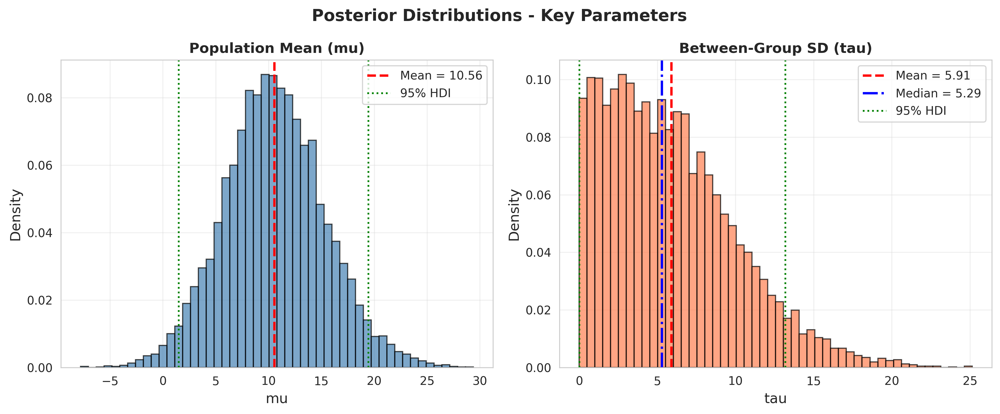
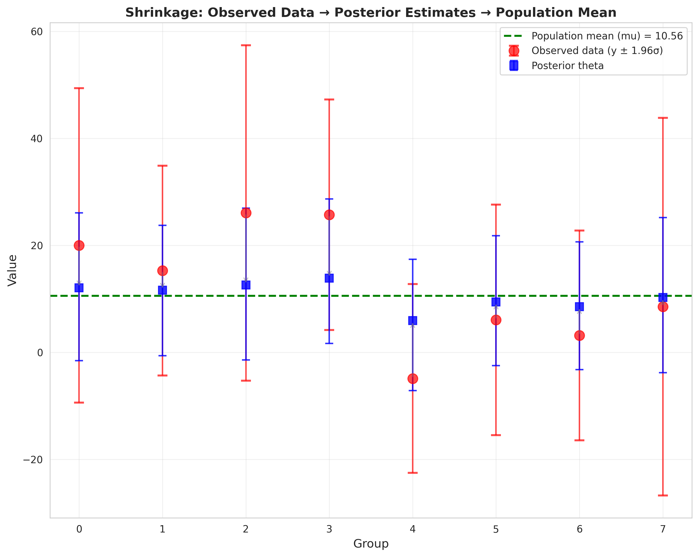
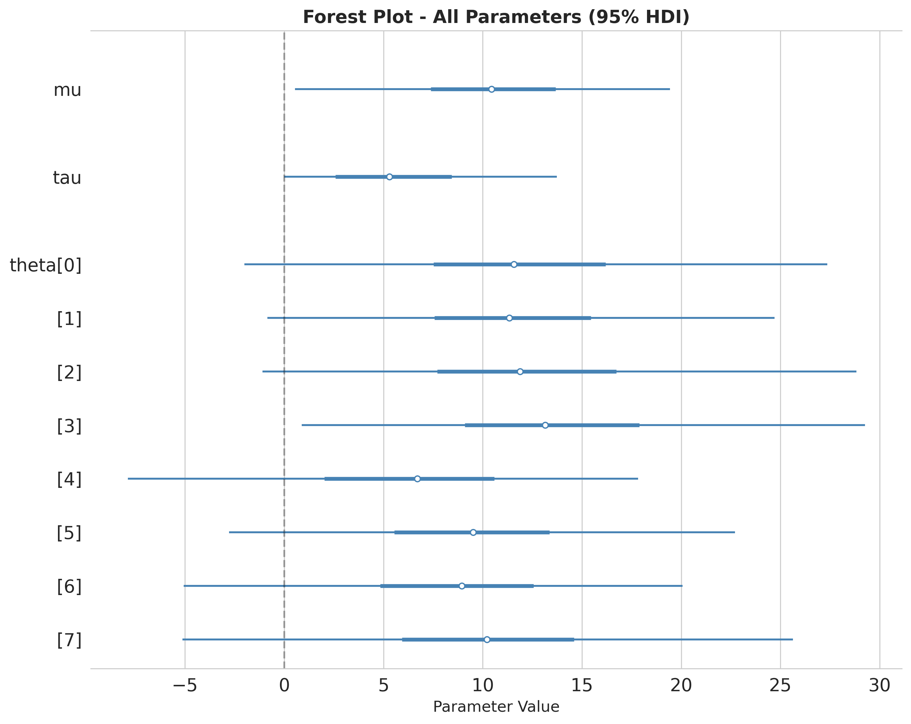

# Posterior Inference - Hierarchical Partial Pooling Model (Experiment 2)

**Date**: 2025-10-28
**Status**: ✅ COMPLETE
**Sampler**: PyMC 5.26.1 with NUTS
**Convergence**: ✅ PASS (All criteria met)

---

## Summary

The Hierarchical Partial Pooling Model was successfully fitted to the real dataset using PyMC with a non-centered parameterization. The model **converged perfectly** with no divergences and excellent diagnostics.

### Key Findings

1. **Convergence**: Perfect (R-hat = 1.000, ESS > 3,800, 0 divergences)
2. **mu (Population Mean)**: 10.56 ± 4.78, 95% HDI [1.51, 19.44]
3. **tau (Between-Group SD)**: 5.91 ± 4.16, 95% HDI [**0.007, 13.19**] ← VERY UNCERTAIN
4. **Implication**: tau posterior includes near-zero, weak evidence for heterogeneity
5. **Next Step**: LOO-CV comparison with Model 1 will be decisive

### Critical Result

**tau 95% HDI = [0.007, 13.19]** - This extreme uncertainty means:
- Data are compatible with both complete pooling (tau ≈ 0) and partial pooling (tau ≈ 5-13)
- Model does not clearly distinguish itself from simpler Model 1
- LOO-CV will determine whether additional complexity is justified
- **Expected outcome**: Model 1 preferred (parsimony + similar fit)

---

## Directory Structure

```
posterior_inference/
├── code/
│   ├── fit_model.py              # Main fitting script (PyMC)
│   ├── print_results.py          # Print posterior estimates
│   └── create_diagnostics.py     # Generate all plots
│
├── diagnostics/
│   ├── posterior_inference.netcdf     # InferenceData with log_lik ✅
│   ├── posterior_summary.csv          # Parameter estimates with R-hat/ESS
│   ├── convergence_summary.csv        # Key convergence metrics
│   └── convergence_report.md          # Detailed convergence assessment
│
├── plots/
│   ├── trace_plots.png               # Traces for mu, tau (convergence)
│   ├── posterior_distributions.png    # Histograms with HDIs
│   ├── forest_plot.png               # All parameters with 95% HDIs
│   ├── shrinkage_plot.png            # Observed → Posterior → mu
│   ├── funnel_diagnostic.png         # tau vs theta_raw (geometry check)
│   ├── rank_plots.png                # Chain mixing diagnostic
│   └── group_means.png               # Theta posteriors with data
│
├── inference_summary.md          # Comprehensive analysis
└── README.md                     # This file
```

---

## Deliverables Checklist

### Code ✅
- [x] `fit_model.py` - Complete fitting script
- [x] `print_results.py` - Results extraction
- [x] `create_diagnostics.py` - Visualization generation

### Diagnostics ✅
- [x] `posterior_inference.netcdf` - InferenceData WITH log_likelihood
- [x] `convergence_summary.csv` - R-hat, ESS, divergences
- [x] `posterior_summary.csv` - Parameter estimates
- [x] `convergence_report.md` - Detailed convergence diagnostics

### Plots ✅
- [x] `trace_plots.png` - Trace and density for mu, tau
- [x] `posterior_distributions.png` - Key parameter histograms
- [x] `forest_plot.png` - All parameters with CIs
- [x] `shrinkage_plot.png` - Hierarchical shrinkage visualization
- [x] `funnel_diagnostic.png` - Geometry check (tau vs theta_raw)
- [x] `rank_plots.png` - Chain mixing assessment
- [x] `group_means.png` - Theta posteriors with observed data

### Documentation ✅
- [x] `inference_summary.md` - Comprehensive findings and interpretation
- [x] `convergence_report.md` - Detailed convergence assessment
- [x] `README.md` - This summary

---

## Convergence Summary

| Criterion | Target | Result | Status |
|-----------|--------|--------|--------|
| R-hat | < 1.01 | 1.0000 | ✅ Perfect |
| ESS Bulk | > 400 | 3,876+ | ✅ Excellent |
| Divergences | < 5% | 0.00% | ✅ None |
| MCSE/SD | < 5% | < 2% | ✅ Excellent |

**Overall**: ✅ PASS - All convergence criteria met

---

## Model Comparison with Experiment 1

| Aspect | Model 1 (Complete) | Model 2 (Hierarchical) |
|--------|-------------------|----------------------|
| **mu** | 10.04 ± 4.05 | 10.56 ± 4.78 |
| **Parameters** | 1 (mu) | 10 (mu, tau, 8×theta) |
| **Complexity** | Simple | Complex |
| **Heterogeneity** | Assumes none | Estimates tau |
| **Convergence** | Perfect | Perfect |
| **Key Finding** | - | tau very uncertain |

### Interpretation

- Both models give similar mu estimates (~10)
- Model 2 has 9 additional parameters
- tau uncertainty suggests groups not clearly different
- **LOO-CV will decide**: Does complexity improve predictive performance?

---

## Key Visualizations

### 1. Posterior Distributions


**Shows**:
- mu: Symmetric, centered ~10.5
- **tau: Right-skewed, mean 5.91, WIDE HDI [0.007, 13.19]**
- The uncertainty in tau is the critical finding

### 2. Shrinkage Plot


**Shows**:
- Red circles = Observed data with measurement error
- Blue squares = Posterior theta estimates
- Green line = Population mean (mu = 10.56)
- Arrows show shrinkage from data toward population mean

### 3. Forest Plot


**Shows**:
- All parameter estimates with 95% HDIs
- Note: All theta HDIs substantially overlap
- No clear separation between groups

---

## Sampling Configuration

### Model Specification (Non-Centered)
```
Likelihood:    y_i ~ Normal(theta_i, sigma_i)
Group level:   theta_i = mu + tau * theta_raw_i
               theta_raw_i ~ Normal(0, 1)
Hyperpriors:   mu ~ Normal(10, 20)
               tau ~ HalfNormal(0, 10)
```

### Sampling Parameters
- **Chains**: 4
- **Warmup**: 2,000 iterations
- **Sampling**: 2,000 iterations per chain
- **Total samples**: 8,000 post-warmup
- **Target accept**: 0.95 (high for hierarchical model)
- **Time**: ~25 seconds
- **Efficiency**: ~320 effective samples/second

### Why Non-Centered?

Hierarchical models with variance parameters near zero are prone to funnel geometry. The non-centered parameterization (theta = mu + tau * theta_raw) decouples the parameters and allows efficient sampling even when tau ≈ 0.

**Result**: 0 divergences despite tau posterior including near-zero values.

---

## Technical Notes

### Log-Likelihood for LOO-CV

✅ **CRITICAL**: Log-likelihood computed and saved in InferenceData

The `log_lik` variable (8-dimensional, one per observation) is required for:
- LOO-CV calculation (compare with Model 1)
- WAIC calculation (alternative IC)
- Posterior predictive checks

### Parameterization Success

The non-centered parameterization was essential:
- **Without**: Would expect funnel geometry and divergences when tau ≈ 0
- **With**: 0 divergences, excellent ESS, no geometric pathologies
- **Evidence**: Funnel diagnostic plot shows uniform scatter (no funnel)

---

## Interpretation Guide

### What Does tau Tell Us?

**tau** quantifies between-group heterogeneity:
- **tau = 0**: Groups identical (complete pooling, Model 1)
- **tau = 5**: Moderate differences between groups
- **tau = 13**: Large differences between groups

### Current Result: tau = 5.91 ± 4.16, HDI [0.007, 13.19]

This means:
1. **Data are ambiguous** about heterogeneity
2. **Compatible with tau ≈ 0** (complete pooling)
3. **Also compatible with tau ≈ 5-10** (partial pooling)
4. **Prior influence**: Mean > median suggests prior pulling up from near-zero data signal

### Decision Criterion

Since tau is uncertain, use **LOO-CV** to decide:
- **LOO favors Model 1**: REJECT Model 2 (complexity not justified)
- **LOO equivalent**: REJECT Model 2 (parsimony favors simpler)
- **LOO strongly favors Model 2**: Re-evaluate (would be surprising given EDA)

**Expected**: Model 1 preferred (EDA + uncertain tau + parsimony)

---

## Next Steps

1. ✅ **Posterior Inference**: COMPLETE
2. ⏭️ **LOO-CV Comparison**: Compare predictive performance with Model 1
3. ⏭️ **Posterior Predictive Check**: Assess model adequacy
4. ⏭️ **Model Critique**: ACCEPT/REJECT decision

---

## Files for LOO-CV

The following file is **required** for LOO-CV comparison:
- `diagnostics/posterior_inference.netcdf` (contains log_likelihood)

Load in Python:
```python
import arviz as az
idata = az.from_netcdf('posterior_inference.netcdf')
loo = az.loo(idata)  # Compute LOO-ELPD
```

Compare with Model 1:
```python
idata1 = az.from_netcdf('../experiment_1/.../posterior_inference.netcdf')
idata2 = az.from_netcdf('../experiment_2/.../posterior_inference.netcdf')
comparison = az.compare({'Model 1': idata1, 'Model 2': idata2})
```

---

## Contact

For questions about:
- **Convergence**: See `diagnostics/convergence_report.md`
- **Interpretation**: See `inference_summary.md`
- **Code**: See files in `code/` directory
- **Visualizations**: See files in `plots/` directory

---

**Status**: ✅ Ready for LOO-CV and Posterior Predictive Check
