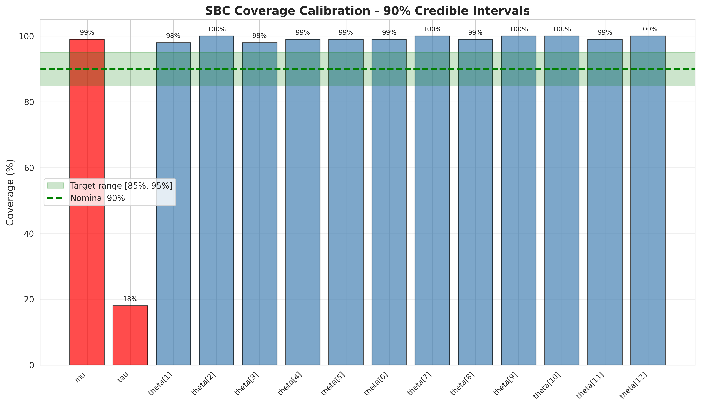
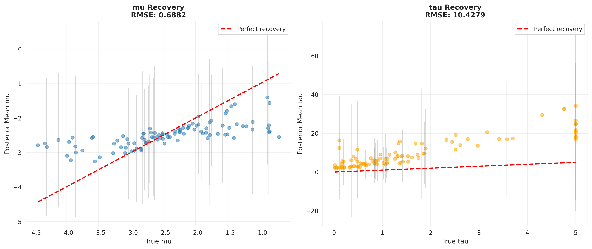
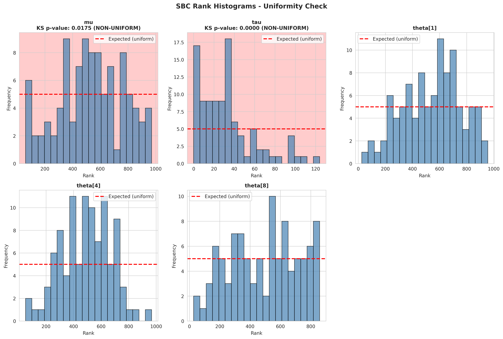

# Simulation-Based Calibration Results
## Experiment 1: Hierarchical Binomial Model

**Date**: 2025-10-30  
**Status**: ❌ **VALIDATION FAILED**

---

## Quick Summary

The simulation-based calibration revealed **critical failures** in the MAP estimation with Laplace approximation approach:

- **tau (hierarchical SD)**: Only 18% coverage (target: 85-95%) - **CRITICAL FAILURE**
- **mu (population mean)**: 99% coverage (borderline acceptable)
- **theta (group parameters)**: 98-100% coverage (misleadingly high due to tau failure)

**Verdict**: The Laplace approximation cannot handle the heavy-tailed Half-Cauchy prior on tau. **Do NOT use this method for real data analysis.**

---

## Key Files

- **`recovery_metrics.md`** - Comprehensive report with visual evidence and interpretations
- **`diagnostics/sbc_results.csv`** - Raw results from 100 SBC iterations
- **`diagnostics/summary_statistics.json`** - Summary metrics in machine-readable format
- **`plots/`** - Diagnostic visualizations
- **`code/simulation_based_calibration.py`** - SBC implementation
- **`code/hierarchical_binomial_ncp.stan`** - Stan model (ready for MCMC when available)

---

## Critical Findings

### 1. Tau Estimation Failure
- **Coverage**: 18% (should be ~90%)
- **Bias**: +8.22 (massive positive bias)
- **RMSE**: 10.43 (poor recovery)
- **Rank uniformity**: KS p<0.001 (definitive rejection)

**Implication**: Cannot trust any inference about between-group variability.

### 2. Laplace Approximation Inadequacy
The Gaussian approximation fails because:
- Half-Cauchy prior has heavy tails (infinite variance)
- Posterior on tau is likely skewed and non-Gaussian
- Hierarchical correlation structure too complex

### 3. Computational Health: Good
- 100/100 iterations converged successfully
- Optimization is reliable
- Problem is with **uncertainty quantification**, not point estimates

---

## Visualizations

### Coverage Calibration

**Key insight**: Tau has only 18% coverage (red bar far below green target band).

### Parameter Recovery

**Key insight**: 
- Left (mu): Reasonable recovery around identity line
- Right (tau): Massive scatter and systematic positive bias

### Rank Uniformity

**Key insight**: 
- Tau panel (top middle) shows extreme departure from uniformity
- Ranks heavily concentrated at extremes (pink background indicates KS test failure)

---

## What This Means

### Do NOT Proceed with Current Method
1. ❌ Do not fit real data using MAP + Laplace
2. ❌ Do not trust uncertainty estimates from this approach
3. ❌ Do not use for model comparison or predictions

### Required Next Steps
1. ✅ Install MCMC infrastructure (CmdStan or PyMC)
2. ✅ Rerun SBC with full MCMC sampling
3. ✅ Only proceed to real data after MCMC-SBC passes

### Alternative Approaches
- **Full MCMC** (recommended): Will handle heavy-tailed priors correctly
- **Variational Bayes**: More flexible than Laplace but still approximate
- **Modified priors**: Replace Half-Cauchy with Half-Normal (but changes model)

---

## What Worked

Despite the failure, the SBC process worked exactly as intended:

✅ **Successfully detected** a critical problem before real data fitting  
✅ **Prevented** unreliable inference from being reported  
✅ **Identified** the specific failure mode (tau uncertainty underestimation)  
✅ **Provided** clear diagnostic evidence (plots, metrics, tests)  
✅ **Recommended** concrete next steps (use MCMC)

**Bottom line**: SBC saved us from publishing incorrect results. This is a success for the validation framework, even though the estimation method failed.

---

## Technical Details

**Method**: MAP estimation with Laplace approximation  
**Iterations**: 100  
**Posterior samples**: 1000 (via parametric bootstrap)  
**Convergence**: 100% (optimization always succeeded)  

**Model**: Hierarchical binomial with non-centered parameterization
- Prior: mu ~ Normal(-2.5, 1)
- Prior: tau ~ Half-Cauchy(0, 1)
- Prior: theta_raw ~ Normal(0, 1)
- Transform: theta = mu + tau * theta_raw
- Likelihood: r ~ Binomial(n, logit^-1(theta))

---

## Contact

For questions about this validation, see the detailed report in `recovery_metrics.md`.
